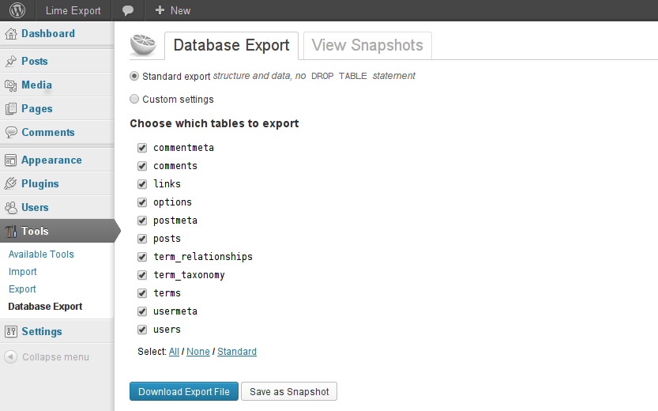
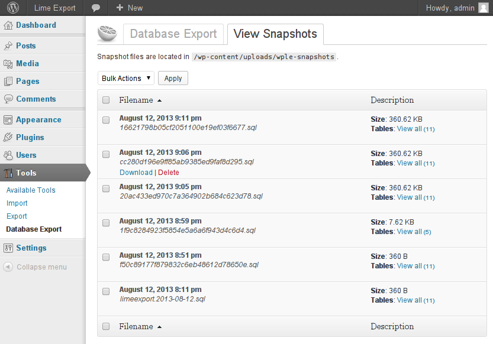

### NOTICE: No longer maintained.

# Lime Export

A WordPress plugin, that allows you to easily export both WordPress core and non-standard tables. 
You are able to save the current database as snapshot, view, manage and download previous snapshots.
Your data may contain sensitive information, that's why great attention is spent on securing it.

## Installation

1. Upload `lime-export` to the `/wp-content/plugins/` directory
1. Activate the plugin through the 'Plugins' menu in WordPress

## Screenshots

<table>
    <tr>
        <td>
            
        </td>
        <td>
            
        </td>
    </tr>
</table>

1. Export options
2. View snapshots

## Changelog

* **v1.0**
  Significant security improvements
  Support WP 3.9 and MySQLi

* **v0.4**
  Improve i18n
  Fix styling in WP 3.8

* **v0.3**
  Save snapshots as PHP files for better prevention from leaking online
  Use cryptic file names for snapshots
  Minor fixes

* **v0.2**
  First stable release.
  Snapshots support

* **v0.1**
  Initial release.
